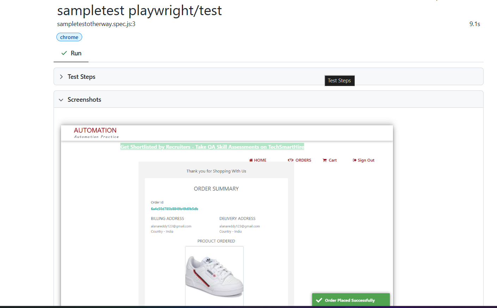
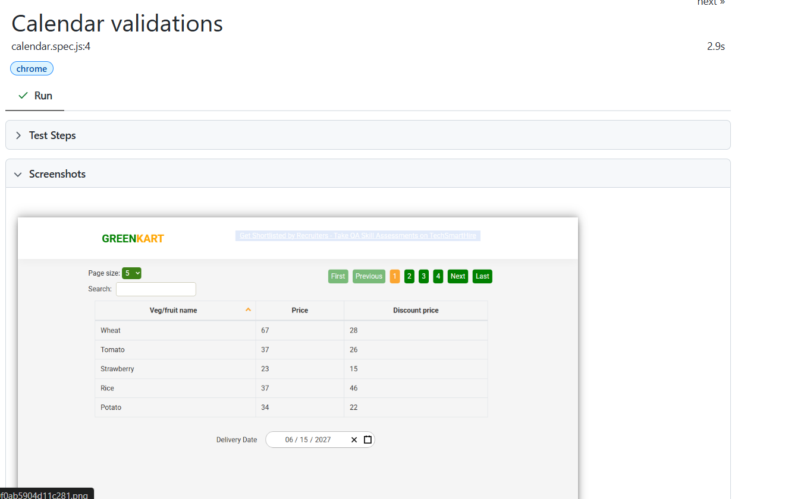
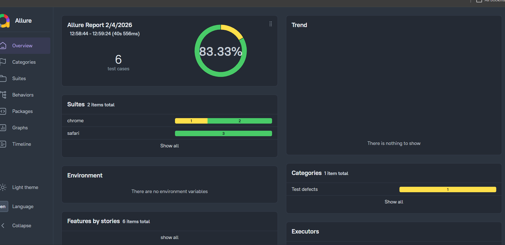
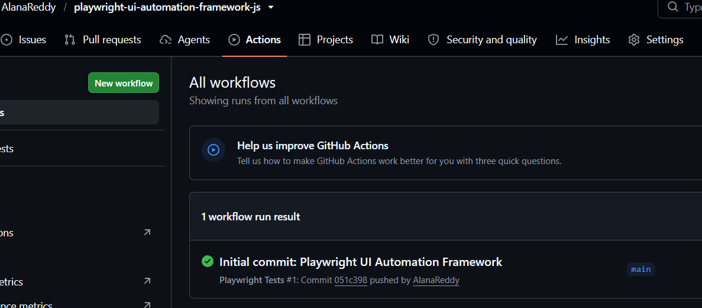

# Playwright UI Automation Framework (JavaScript)

## Overview

This repository contains a Playwright automation framework developed using JavaScript to strengthen my automation testing skills through hands-on implementation.

The project combines a reusable Page Object Model (POM) framework for end-to-end testing of an e-commerce application with separate practice modules covering Playwright features such as API testing, network interception, request mocking, browser interactions, reporting, and Cucumber.

The primary focus of this project was to build a maintainable automation framework while gaining practical experience with modern Playwright testing techniques and industry best practices.
## About This Project

I developed this project while learning Playwright automation through a structured course and continued expanding it by practising additional Playwright features independently.

Rather than focusing only on a single end-to-end test, I used this repository to explore different areas of automation testing, including API testing, browser automation, network interception, request mocking, reporting, and framework design.

This repository continues to evolve as I expand my Playwright automation skills by implementing additional automation concepts and framework enhancements.
## Technologies Used

| Category | Technology |
|----------|------------|
| Programming Language | JavaScript (Node.js) |
| Automation Framework | Playwright |
| Design Pattern | Page Object Model (POM) |
| BDD Framework | Cucumber |
| Test Runner | Playwright Test |
| API Testing | Playwright APIRequestContext |
| Reporting | Allure Reports, Playwright HTML Report |
| CI/CD | GitHub Actions |
| Version Control | Git & GitHub |
| IDE | Visual Studio Code |
| Professional QA Tools | Jira, Zephyr, Confluence|

## Repository Contents

This repository is organised into two logical sections to demonstrate both framework development and practical Playwright learning.

### 1. End-to-End Automation Framework

A reusable automation framework built using the Page Object Model (POM) design pattern for automating an e-commerce application.

Framework components include:

- Page Object Model (POM)
- Page Object Manager
- Login, Dashboard, Cart and Order page classes
- JSON-based test data
- Reusable utility methods
- End-to-end order placement workflow
- HTML and Allure reporting

### 2. Playwright Learning Modules

Alongside the framework, this repository contains individual practice scripts developed while learning Playwright concepts.

These modules demonstrate:

- API Testing
- Network Request & Response Interception
- Request Mocking
- Browser Context Handling
- Child Window Handling
- Calendar Automation
- Modern Playwright Locators
- File Upload & Download
- Mouse Hover
- Hidden Elements
- Cucumber (BDD)

## Framework Capabilities

This project includes practical implementations of Playwright automation concepts through a reusable Page Object Model framework and dedicated learning modules.

### End-to-End Automation Framework
- Reusable Page Object Model (POM) design
- Page Object Manager for centralized page object creation
- End-to-end automation of user login, product selection, checkout and order validation
- JSON-based test data management
- Modular and maintainable test structure

### UI Automation
- Login, product search, cart, checkout, and order validation
- Modern Playwright locators (`getByRole`, `getByText`, `getByLabel`, etc.)
- Browser Context Handling
- Child Window Handling
- Calendar/date picker automation
- Mouse hover and hidden element validation
- File upload and download scenarios

### API & Network Testing
- API-based order creation using Playwright
- API response validation
- Network request and response interception
- Request mocking for controlled testing

### Framework & Execution
- Cross-browser execution
- Cucumber (BDD) integration
- Playwright HTML Reports
- Allure Reports
- GitHub Actions workflow for automated test execution

## Project Structure

| Folder / File | Description |
|---------------|-------------|
| `.github/workflows` | GitHub Actions workflow for automatically running Playwright tests. |
| `docs` | Contains project documentation and screenshots used in the README. |
| `features` | Cucumber feature files written in Gherkin syntax for BDD scenarios. |
| `tests` | Playwright test scripts covering end-to-end scenarios and Playwright learning concepts. |
| `tests/pageobjects` | Page Object Model classes used to build a reusable and maintainable automation framework. |
| `utils` | Shared utility classes, API helper methods, and test data used across the framework. |
| `playwright.config.js` | Playwright configuration for browsers, reporters, and execution settings. |
| `cucumber.js` | Cucumber configuration used for BDD execution. |
| `package.json` | Project dependencies and npm scripts. |
| `README.md` | Project documentation and usage guide. |

## Running the Project

### Prerequisites

Ensure the following are installed before running the project:

- Node.js
- Visual Studio Code
- Git

### Installation

Clone the repository:

```bash
git clone https://github.com/AlanaReddy/playwright-ui-automation-framework-js.git```

Navigate to the project folder:

```bash
cd playwright-ui-automation-framework-js```

Install dependencies:

```bash
npm install
```

Install Playwright browsers:

```bash
npx playwright install
```

### Execute Tests

Run all Playwright tests:

```bash
npx playwright test
```

Run a specific test:

```bash
npx playwright test tests/sampletestPO.spec.js
```

Run Cucumber tests:

```bash
npx cucumber-js
```
## Test Reports

The framework supports multiple reporting options to help analyze test execution results, identify failures, and assist with debugging.

### Playwright HTML Report

Playwright's built-in HTML report provides a detailed summary of test execution, including passed and failed tests, execution time, error messages, and trace information.




---

### Allure Report

Allure Report provides an interactive view of test execution with detailed test results, execution history, and rich reporting for easier analysis.



---

### GitHub Actions

The project includes a GitHub Actions workflow that automatically executes Playwright tests whenever code is pushed to the repository, enabling continuous integration and automated validation.



## AI-Assisted Development
While developing this project, I used AI as a learning assistant to deepen my understanding of Playwright and automation framework design.

AI was used to:

- Explore different Playwright implementation approaches
- Improve Page Object Model design and code organisation
- Generate additional test scenarios for practice
- Understand modern locator strategies and Playwright features
- Troubleshoot automation issues during framework development
- Learn automation best practices and compare alternative solutions

All generated suggestions were reviewed, tested and adapted before being incorporated into the project. The primary objective was to strengthen my understanding rather than simply generate code.

## Author

**Alana Reddy Almawar**

Software Test Engineer with experience in Manual Testing and currently expanding expertise in Playwright automation using JavaScript, API testing, and modern automation framework design.

GitHub Profile:
https://github.com/AlanaReddy

Project Repository:
https://github.com/AlanaReddy/playwright-ui-automation-framework-js

## Key Learning Outcomes

Through this project, I gained practical experience in:

- Designing a reusable automation framework using the Page Object Model (POM)
- Developing maintainable Playwright test scripts using JavaScript
- Implementing API testing and network interception
- Generating and analyzing Playwright and Allure reports
- Configuring GitHub Actions for automated test execution
- Applying Git and GitHub for version control and collaborative development
- Leveraging AI as a learning assistant to accelerate understanding of modern automation testing concepts